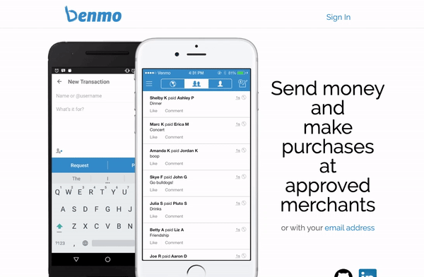
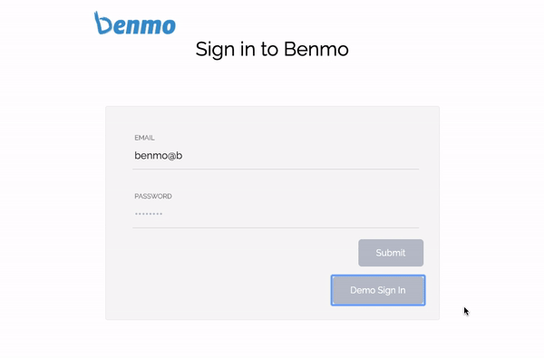
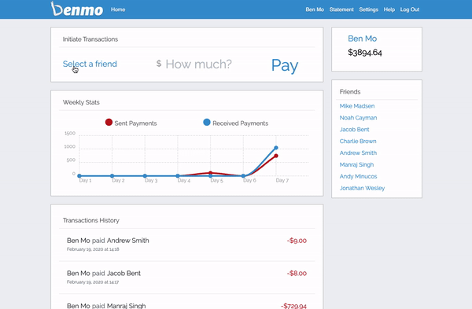
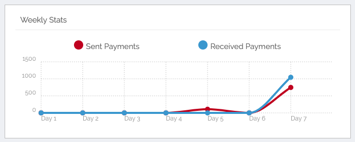
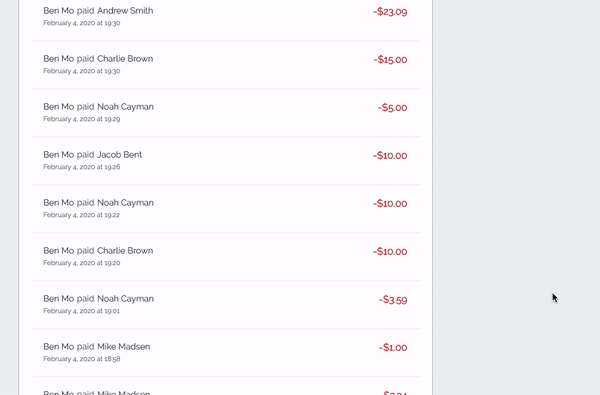

[](http://benmo.herokuapp.com/)

# 

Benmo is a clone of Venmo, which is a service of PayPal, Inc., a licensed provider of money transfer services. This web application allows users to create an account to use transaction services with their friends.

&nbsp;



&nbsp;

## Technology
* Frontend: `JavaScript`, `React.js`, `Redux.js`
* Backend: `Ruby on Rails`, `PostgreSQL`, `ActiveRecord`

## Features and MVPs

### User authorization
* Securely salt and hash users' passwords using BCrypt
* Users are able to sign up, login, and logout



```ruby
    def password=(password)
        @password = password
        self.password_digest = BCrypt::Password.create(password)
    end

    def is_password?(password)
        BCrypt::Password.new(self.password_digest).is_password?(password)
    end

```

### Transaction Initiation
* User is able to send payments to friends




```javascript
    handleChange(e, field) {
        if (field === "amount" && parseFloat(e.target.value) < 0) {
            this.setState({ [field]: 0 });
        } else {
            this.setState({ [field]: parseFloat(e.target.value).toFixed(2) });
        }
    }

    handleSubmit(e) {
        if (parseFloat(this.state.amount) === 0) {
            alert("You must give a valid amount");
        } else if (this.state.receiver_id === null) {
            alert("You must select a payee");
        } else {
            this.props.createATransaction(this.state, this.props.currentUser);
        }
    }
```

### Weekly Stats of Transactions of Past 7 Days
* Graph of past 7 day transactions is provided
* User is able to check both sent and received transactions in one place




```ruby
    def graph
        @sent_transactions = Transaction.where(created_at: 6.days.ago..Time.now, sender_id: params[:id])
        @received_transactions = Transaction.where(created_at: 6.days.ago..Time.now, receiver_id: params[:id])


        # sent transactions
        result = []
        current_day = 6.days.ago
        day_transactions = []
   
        i = 0
        while result.length < 7
            if i >= @sent_transactions.length || current_day.end_of_day < @sent_transactions[i].created_at
                current_day = (current_day.next_day(1))
                result.push(day_transactions)
                day_transactions = []
                next
            end

            if i < @sent_transactions.length && current_day.day == @sent_transactions[i].created_at.day && current_day.month == @sent_transactions[i].created_at.month && current_day.year == @sent_transactions[i].created_at.year
                day_transactions.push(@sent_transactions[i])
            end

            i += 1
        end
```


### Transaction History View
* User is able to see the list of the past transactions in the order of processed date and time




```javascript
    componentDidMount() {
        this.props.clearTransactions()
        this.props.fetchAll(this.props.currentUser)
    } 

    getDate(string) {
        const month = ["January", "February", "March", "April", "May", "June", "July",
            "August", "September", "October", "November", "December"]
        let date = new Date(Date.parse(string));
        
        return (
            `${month[date.getMonth()]} ${date.getDate()}, ${date.getFullYear()} at ${date.toTimeString().slice(0, 5)}`
        )
    }
```


## Future Plans
* Friends Requests
* Allow users to add comments along with initiating transactions


